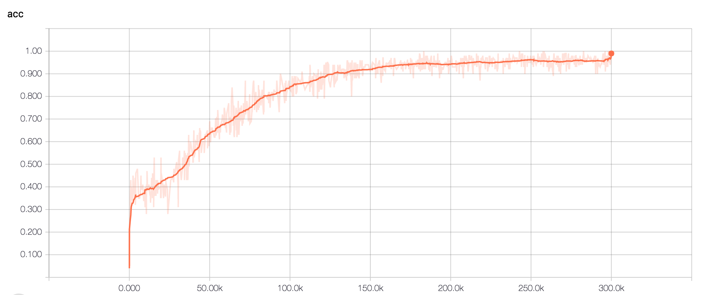
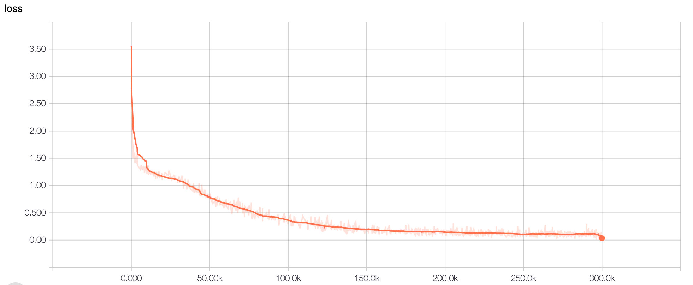

## Using Fast Weights to Attend to the Recent Past

Reproducing the associative model experiment on the paper

[Using Fast Weights to Attend to the Recent Past](https://arxiv.org/abs/1610.06258) by Jimmy Ba et al. (Incomplete)


### Prerequisites

Tensorflow (version >= 0.8)


### How to Run the Experiments

Generate a dataset

```
$ python generator.py
```

This script generates a file called `associative-retrieval.pkl`, which can be used for training.


Run the model

```
$ python fw.py
```


### Findings

The following is the accuracy and loss graph for$R=20. **The experiments are barely tuned.**






**Layer Normalization is extremely crucial for the success of training.** 

- Otherwise, training will not converge when the inner step is larger than 1. 
- Even when inner step of 1, the performance without layer normalization is much worse. For R=20, only 0.4 accuracy can be achieved (which is same as the level of other models.)
- Even with Layer Normalization, using slow weights (ie. vanilla RNN) is much worse than using fast weights.


Further improvements:

- Complete fine-tuning
- Work on other tasks


### References

[Using Fast Weights to Attend to the Recent Past](https://arxiv.org/abs/1610.06258). Jimmy Ba,  Geoffrey Hinton, Volodymyr Mnih, Joel Z. Leibo, Catalin Ionescu.

[Layer Normalization](https://arxiv.org/abs/1607.06450). Jimmy Ba, Ryan Kiros, Geoffery Hinton.